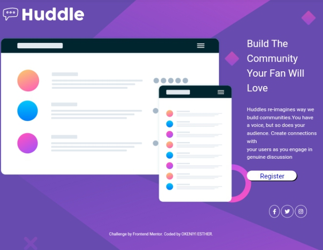

# Frontend Mentor - Huddle landing page with single introductory section solution

This is a solution to the [Huddle landing page with single introductory section challenge on Frontend Mentor](https://www.frontendmentor.io/challenges/huddle-landing-page-with-a-single-introductory-section-B_2Wvxgi0). Frontend Mentor challenges help you improve your coding skills by building realistic projects. 

## Table of contents

- [Overview](#overview)
  - [The challenge](#the-challenge)
  - [Screenshot](#screenshot)
  - [Links](#links)
- [My process](#my-process)
  - [Built with](#built-with)
  - [What I learned](#what-i-learned)
  - [Continued development](#continued-development)
  - [Useful resources](#useful-resources)
- [Author](#author)
- [Acknowledgments](#acknowledgments)

**Note: Delete this note and update the table of contents based on what sections you keep.**

## Overview

### The challenge

Users should be able to:

- View the optimal layout for the page depending on their device's screen size
- See hover states for all interactive elements on the page

### Screenshot
    

Add a screenshot of your solution. The easiest way to do this is to use Firefox to view your project, right-click the page and select "Take a Screenshot". You can choose either a full-height screenshot or a cropped one based on how long the page is. If it's very long, it might be best to crop it.

Alternatively, you can use a tool like [FireShot](https://getfireshot.com/) to take the screenshot. FireShot has a free option, so you don't need to purchase it. 

Then crop/optimize/edit your image however you like, add it to your project, and update the file path in the image above.

**Note: Delete this note and the paragraphs above when you add your screenshot. If you prefer not to add a screenshot, feel free to remove this entire section.**

### Links
https://gitHub.com/EstilRoyce/Hurdle-Landing-page
https://heroic-dasik-2b1769.netlify.app/

- Solution URL: [Add solution URL here](https://gitHub.com/EstilRoyce/Hurdle-Landing-page)
- Live Site URL: [Add live site URL here](https://heroic-dasik-2b1769.netlify.app/)

## My process
I was able to export my files and open with VScode, created my HTML file ,Folder for CSS,images and I also followed the instructions on how to go about the project to get the design

### Built with

- Semantic HTML5 markup
- CSS custom properties
- Flexbox
-Mobile-First Workflow
-VS code

### What I learned
I learnt how to make use of flex box, positioning,Margin,Border, Padding and other CSS properties where it is needed.

### Continued development
Learning more on the CSS properties

### Useful resources
[Frontend Mentor]
## Author: Okolie Uche

- Website -[Netlify](https://www.your-site.com)
- Frontend Mentor - [@estilroyce](https://www.frontendmentor.io/profile/yourusername)
- Twitter - [@estil-royce](https://www.twitte∆∆∆r.com/estil-royce)

## Acknowledgments

I want to appreciate Techathon community for the great opportunity to learn HTML, CSS  and for giving me a good Mentor like Ace , thank you.
